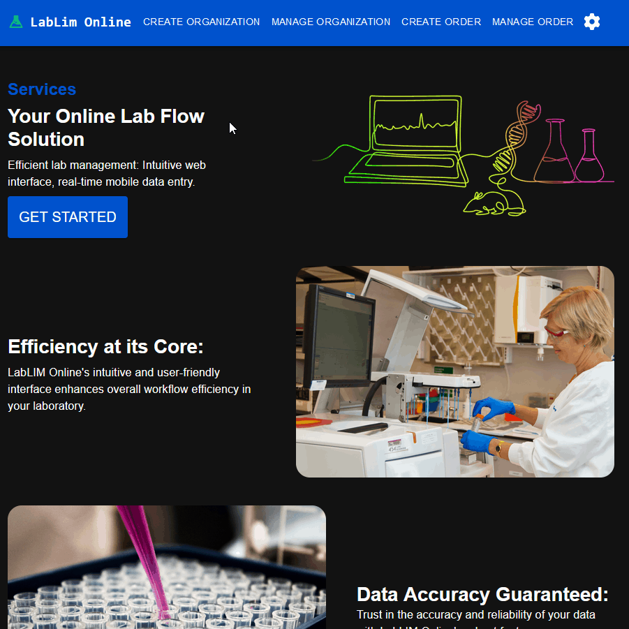

<picture>
  
</picture>
<h3 align="center"></h3>

  
  
  
  

I'm a Full-stack Software Engineer based in New York passionate about crafting exceptional web applications.</h3>

Visit <a href="https://www.jordanrusso.xyz/dev">my website</a> for more!

<h1 align="center">Projects</h1>
<!-- Project Table Start -->
<table align="center" bordercolor="#fff">
  <!-- First Row -->
  <tr align="center">
    <td width="50%">
      <h3 align="center">LabLIM Online</h3>
      
       
      
      
          
        
      

      
A platform that connects clients who need testing with organizations that can do it while streamlining the process. 

    </td>
    <td width="50%">
      <h3 align="center">Mungo Meal</h3>
      
       
      
      
          
        
      

      
Empower Your Plate; Know Your Food, Uncover the Truth of Foods when you shop!

    </td>    
  </tr>
  <!-- second row -->
  <tr align="center">
    <td width="50%">
      <h3 align="center">Tribal</h3>
      
       
      
      
          
        
      

      
Return to your community on Tribal! Dive into unforgettable moments and bond with souls that resonate with your vision.

    </td>
    <td width="50%">
      <h3 align="center">Urban Cuts</h3>
      
       
      
      
          
        
      

      
A friendly and attractive contemporary website for a local barbershop where locals can get the sharpest cuts!

    </td>
  </tr>
</table>
<!-- Table End -->

<h1 align="center">Technologies</h1>

  <picture></picture>
  <picture></picture>
  <picture></picture>
  <picture></picture>
  <picture></picture>
  <picture></picture>
  <picture></picture>
  <picture></picture>
  <picture></picture>

<h1 align="center">Connect</h1>

  
  
  
  

